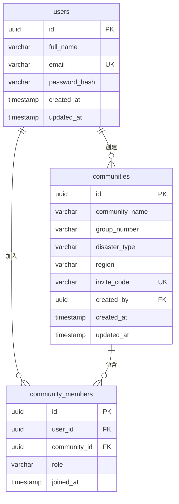

# 灾害恢复社区管理系统 - 数据库设计文档

## 1. 概述

本文档基于 `POST /api/register` 和 `POST /api/login` 两个接口的需求，设计 PostgreSQL 数据库方案。核心业务逻辑为：用户注册时自动创建社区并成为管理员（admin），其他用户通过邀请码（inviteCode）加入社区成为普通成员（member）。

---

## 2. ER 关系图



---

## 3. 表结构设计

### 3.1 `users` — 用户表

存储用户基本信息和认证凭据。

| 字段 | 类型 | 约束 | 说明 |
|------|------|------|------|
| `id` | `UUID` | PRIMARY KEY, DEFAULT gen_random_uuid() | 用户唯一标识 |
| `full_name` | `VARCHAR(100)` | NOT NULL | 用户全名（对应接口 fullName） |
| `email` | `VARCHAR(255)` | NOT NULL, UNIQUE | 登录邮箱，全局唯一 |
| `password_hash` | `VARCHAR(255)` | NOT NULL | bcrypt 哈希后的密码（**不存明文**） |
| `created_at` | `TIMESTAMP WITH TIME ZONE` | NOT NULL, DEFAULT NOW() | 创建时间 |
| `updated_at` | `TIMESTAMP WITH TIME ZONE` | NOT NULL, DEFAULT NOW() | 更新时间 |

**索引：**
- `uq_users_email` — UNIQUE 约束自动创建唯一索引（登录查询高频使用）

---

### 3.2 `communities` — 社区表

存储社区/团体的基本信息，包括灾害类型和受影响区域。

| 字段 | 类型 | 约束 | 说明 |
|------|------|------|------|
| `id` | `UUID` | PRIMARY KEY, DEFAULT gen_random_uuid() | 社区唯一标识 |
| `community_name` | `VARCHAR(200)` | NOT NULL | 社区名称（对应接口 communityName） |
| `group_number` | `VARCHAR(50)` | NULLABLE | 组号（对应接口 groupNumber，可选） |
| `disaster_type` | `VARCHAR(100)` | NOT NULL | 灾害类型（如 flood, earthquake 等） |
| `region` | `VARCHAR(200)` | NOT NULL | 受影响区域 |
| `invite_code` | `VARCHAR(10)` | NOT NULL, UNIQUE | 6位邀请码，用于其他用户加入 |
| `created_by` | `UUID` | NOT NULL, REFERENCES users(id) | 创建者（注册者）用户 ID |
| `created_at` | `TIMESTAMP WITH TIME ZONE` | NOT NULL, DEFAULT NOW() | 创建时间 |
| `updated_at` | `TIMESTAMP WITH TIME ZONE` | NOT NULL, DEFAULT NOW() | 更新时间 |

**索引：**
- `uq_communities_invite_code` — UNIQUE 约束自动创建唯一索引（加入社区时查询）
- `idx_communities_disaster_type` — 在 `disaster_type` 上建索引（按灾害类型筛选）
- `idx_communities_region` — 在 `region` 上建索引（按区域筛选）

---

### 3.3 `community_members` — 社区成员关系表

维护用户与社区的多对多关系，以及用户在社区中的角色。

| 字段 | 类型 | 约束 | 说明 |
|------|------|------|------|
| `id` | `UUID` | PRIMARY KEY, DEFAULT gen_random_uuid() | 记录唯一标识 |
| `user_id` | `UUID` | NOT NULL, REFERENCES users(id) ON DELETE CASCADE | 用户 ID |
| `community_id` | `UUID` | NOT NULL, REFERENCES communities(id) ON DELETE CASCADE | 社区 ID |
| `role` | `VARCHAR(20)` | NOT NULL, DEFAULT 'member' | 角色：'admin' 或 'member' |
| `joined_at` | `TIMESTAMP WITH TIME ZONE` | NOT NULL, DEFAULT NOW() | 加入时间 |

**约束：**
- `uq_user_community` — (user_id, community_id) 联合唯一约束，防止重复加入
- `chk_role` — CHECK (role IN ('admin', 'member'))

**索引：**
- `idx_cm_user_id` — 在 `user_id` 上建索引（查询用户所属社区）
- `idx_cm_community_id` — 在 `community_id` 上建索引（查询社区成员列表）

---

## 4. 接口与数据库的映射关系

### 4.1 POST /api/register 流程

```
1. 验证请求参数（email 格式、password 长度 >= 8 等）
2. 检查 email 是否已存在 → SELECT FROM users WHERE email = ?
3. 开启事务 BEGIN
   a. 插入 users 表 → INSERT INTO users (full_name, email, password_hash)
   b. 生成 6 位随机 invite_code
   c. 插入 communities 表 → INSERT INTO communities (community_name, group_number, disaster_type, region, invite_code, created_by)
   d. 插入 community_members 表 → INSERT INTO community_members (user_id, community_id, role) VALUES (?, ?, 'admin')
4. 提交事务 COMMIT
5. 返回 { userId, groupName, inviteCode, createdAt }
```

**字段映射：**

| 接口字段 | 数据库表.字段 |
|----------|--------------|
| fullName | users.full_name |
| email | users.email |
| password | users.password_hash（bcrypt 加密后存储） |
| communityName | communities.community_name |
| groupNumber | communities.group_number |
| disasterType | communities.disaster_type |
| region | communities.region |
| 响应 userId | users.id |
| 响应 groupName | communities.community_name |
| 响应 inviteCode | communities.invite_code |
| 响应 createdAt | users.created_at |

### 4.2 POST /api/login 流程

```
1. 验证请求参数
2. 查询用户 → SELECT id, full_name, email, password_hash FROM users WHERE email = ?
3. 验证密码 → bcrypt.compare(password, password_hash)
4. 查询用户角色 → SELECT role FROM community_members WHERE user_id = ? LIMIT 1
5. 生成 JWT token（payload: { userId, email, role }，有效期 3600 秒）
6. 返回 { id, name, email, role, token, expiresIn }
```

**字段映射：**

| 接口字段 | 数据库表.字段 |
|----------|--------------|
| email（请求） | users.email |
| password（请求） | users.password_hash（bcrypt 比对） |
| 响应 id | users.id |
| 响应 name | users.full_name |
| 响应 email | users.email |
| 响应 role | community_members.role |
| 响应 token | 服务端生成的 JWT |
| 响应 expiresIn | JWT 配置值（3600） |

---

## 5. SQL 建表语句

```sql
-- 启用 UUID 扩展
CREATE EXTENSION IF NOT EXISTS "pgcrypto";

-- 用户表
CREATE TABLE users (
    id              UUID PRIMARY KEY DEFAULT gen_random_uuid(),
    full_name       VARCHAR(100) NOT NULL,
    email           VARCHAR(255) NOT NULL,
    password_hash   VARCHAR(255) NOT NULL,
    created_at      TIMESTAMP WITH TIME ZONE NOT NULL DEFAULT NOW(),
    updated_at      TIMESTAMP WITH TIME ZONE NOT NULL DEFAULT NOW(),
    CONSTRAINT uq_users_email UNIQUE (email)
);

-- 社区表
CREATE TABLE communities (
    id               UUID PRIMARY KEY DEFAULT gen_random_uuid(),
    community_name   VARCHAR(200) NOT NULL,
    group_number     VARCHAR(50),
    disaster_type    VARCHAR(100) NOT NULL,
    region           VARCHAR(200) NOT NULL,
    invite_code      VARCHAR(10) NOT NULL,
    created_by       UUID NOT NULL REFERENCES users(id),
    created_at       TIMESTAMP WITH TIME ZONE NOT NULL DEFAULT NOW(),
    updated_at       TIMESTAMP WITH TIME ZONE NOT NULL DEFAULT NOW(),
    CONSTRAINT uq_communities_invite_code UNIQUE (invite_code)
);

CREATE INDEX idx_communities_disaster_type ON communities (disaster_type);
CREATE INDEX idx_communities_region ON communities (region);

-- 社区成员关系表
CREATE TABLE community_members (
    id              UUID PRIMARY KEY DEFAULT gen_random_uuid(),
    user_id         UUID NOT NULL REFERENCES users(id) ON DELETE CASCADE,
    community_id    UUID NOT NULL REFERENCES communities(id) ON DELETE CASCADE,
    role            VARCHAR(20) NOT NULL DEFAULT 'member',
    joined_at       TIMESTAMP WITH TIME ZONE NOT NULL DEFAULT NOW(),
    CONSTRAINT uq_user_community UNIQUE (user_id, community_id),
    CONSTRAINT chk_role CHECK (role IN ('admin', 'member'))
);

CREATE INDEX idx_cm_user_id ON community_members (user_id);
CREATE INDEX idx_cm_community_id ON community_members (community_id);

-- updated_at 自动更新触发器
CREATE OR REPLACE FUNCTION update_updated_at()
RETURNS TRIGGER AS $$
BEGIN
    NEW.updated_at = NOW();
    RETURN NEW;
END;
$$ LANGUAGE plpgsql;

CREATE TRIGGER trg_users_updated_at
    BEFORE UPDATE ON users
    FOR EACH ROW EXECUTE FUNCTION update_updated_at();

CREATE TRIGGER trg_communities_updated_at
    BEFORE UPDATE ON communities
    FOR EACH ROW EXECUTE FUNCTION update_updated_at();
```

---

## 6. 设计要点

**密码安全**：使用 bcrypt 对密码进行哈希存储，数据库中绝不保存明文密码。建议 salt rounds 为 10-12。

**邀请码生成**：invite_code 为 6 位大写字母+数字的随机字符串，需在插入前检查唯一性。若冲突则重新生成。

**事务一致性**：注册流程中用户创建、社区创建、成员关系插入必须在同一事务中完成，任一步骤失败则全部回滚。

**角色设计**：当前仅有 admin 和 member 两种角色。注册者自动为 admin，通过邀请码加入的为 member。如未来需要更多角色，可将 CHECK 约束修改或改用角色表。

**updated_at 自动更新**：已通过 PostgreSQL 触发器（`trg_users_updated_at`、`trg_communities_updated_at`）在行更新时自动设置 `updated_at = NOW()`。
